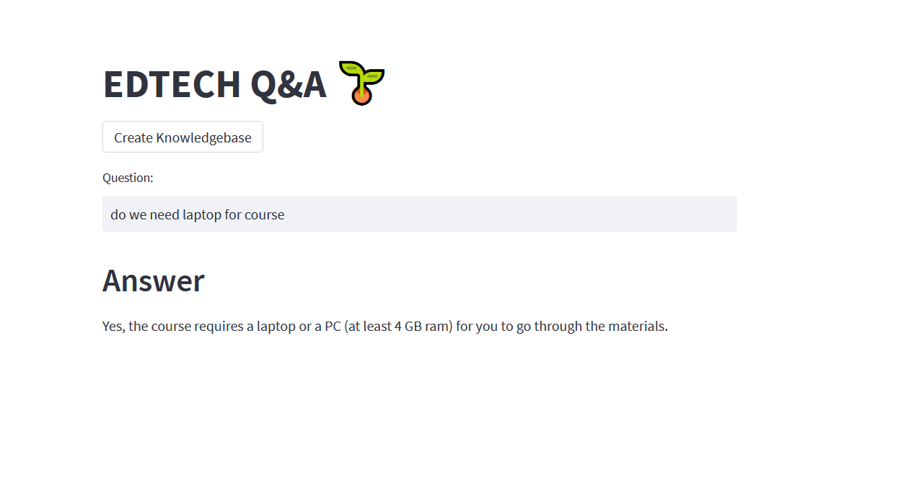

# EdTech-LLM-QA-System

This project is a **Question & Answer** web application built using **Streamlit**, **Langchain**, and **FAISS**. The app allows users to create a knowledge base from a CSV file and query it to get answers to their questions. It utilizes a **vector database** to store FAQ data and an **OpenAI-powered QA chain** to provide answers based on the context in the database.

## Demo

Here is a screenshot showing the app's result in action:

## Features

- **Create Knowledgebase**: Upload a CSV file with question-answer pairs and create a vector database for fast similarity-based retrieval.
- **Ask Questions**: After creating the knowledge base, users can enter questions, and the system will return answers based on the stored documents.

## Requirements

- Python 3.10
- Streamlit
- Langchain
- FAISS
- OpenAI API
- Python-dotenv
- Additional libraries in `requirements.txt`

## Installation Guide

Follow the steps below to set up the project locally:

### 1. Clone the Repository

git clone https://github.com/vishnu-kg/EdTech-LLM-QA-System.git

### 2.  Set Up a Virtual Environment

 python3 -m venv venv
 venv\Scripts\activate (for windows)

### 3. Install the Required Dependencies

pip install -r requirements.txt

### 4. Set Up Environment Variables

OPENAI_API_KEY=your-openai-api-key

### 5.  Run the Application

streamlit run main.py

##   How to Use
### Create Knowledgebase

   - Click on the "Create Knowledgebase" button.
   - Upload a CSV file containing FAQ data. The CSV must have a questions or prompt column with the questions and an answer column with the answer

### Ask Questions
 - After the knowledgebase is created, enter your question in the input field.
 - The system will provide an answer based on the context stored in the vector database.

## Project structure

 

